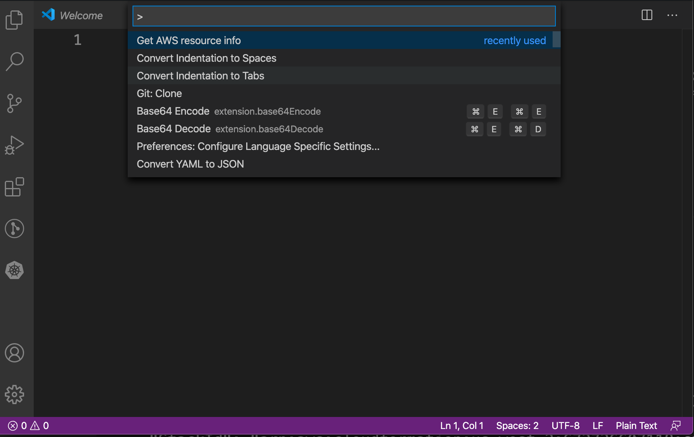
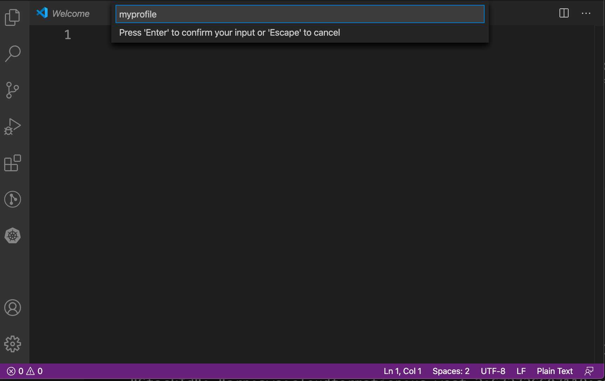
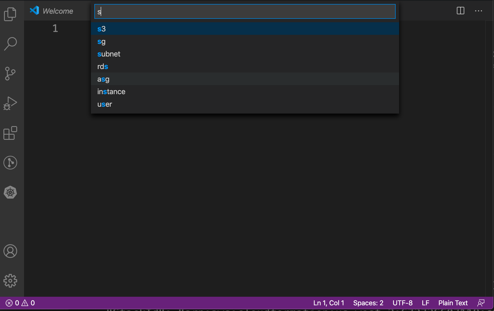
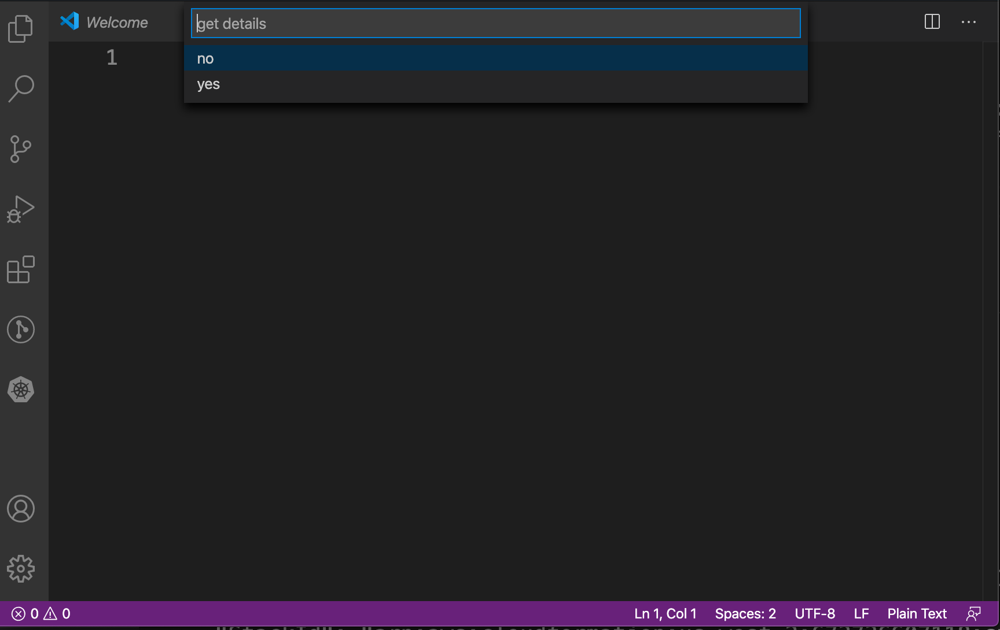
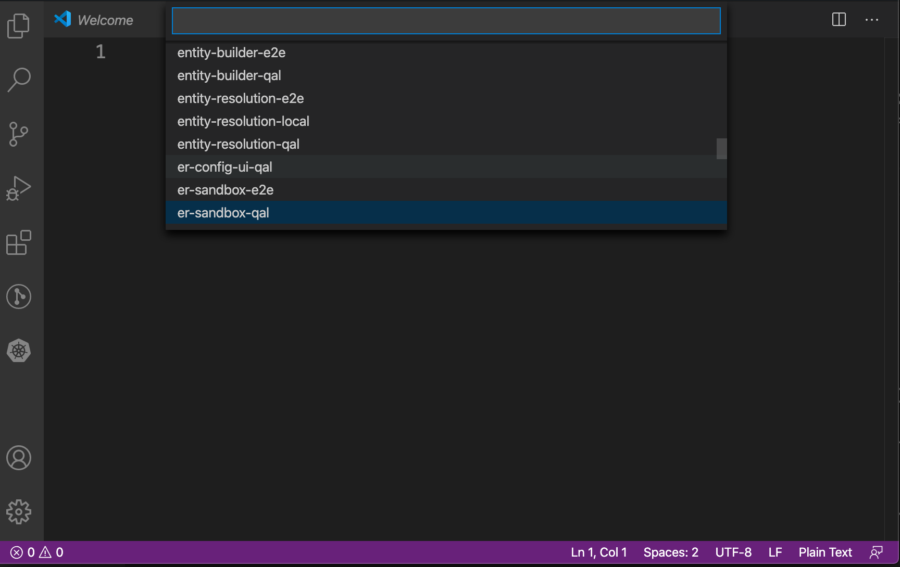
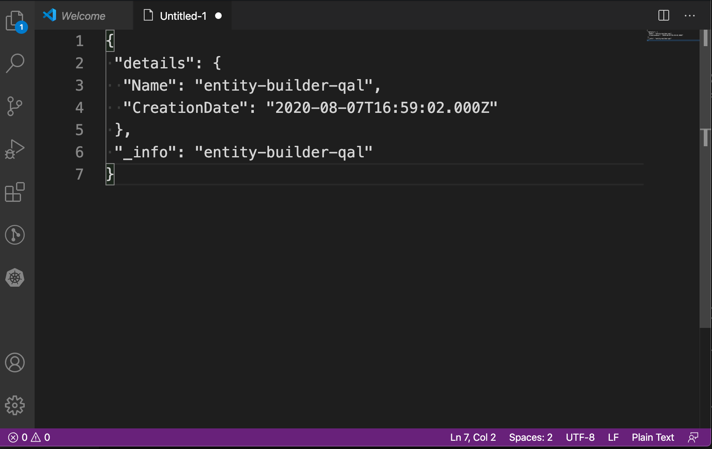

# Simple AWS extension

This is a simple Visual Studio Code extension to get a list of several AWS resource types, which are obtained via the AWS CLI and a profile.

## Features

**Note:** See [Requirements](#requirements) before you start using the extension.

Press `Ctrl + Shift + P` (Windows) or `Command + Shift + P` (Mac) to open the
actions menu, type `Get AWS resource info` and press `Return`.

Type the name of the AWS profile you want to use to connect to your AWS account.
This profile must be previously configured with the `aws configure` command.

A list of several resource types appears, select or start typing the resource type
you need, then press `Return`.

Specify if you want to get the resource info (a simple string representation of
the resource, which normally includes ID, Name, and commonly used properties) or 
details (a JSON representation with all the details of a resource).

Then select a resource from the list given. If the extension errors before this list, check the error details on the popup shown.

Now, if you have a document open, then the information is appended as text in the document. If you don't have a document open, then all the information will be put in the clipboard.

## Requirements

- [AWS CLI](https://aws.amazon.com/cli/) installed.
- You need to set AWS credentials for a [profile](https://awscli.amazonaws.com/v2/documentation/api/latest/reference/configure/index.html?highlight=configure) so it can be used by the extension.

## Release Notes

### 0.0.2

- Resources added:
  - s3 (S3 buckets)
  - kms (KMS keys)
  - role (IAM roles)
  - user (IAM users)
  - policies (IAM policies)
  - rds (RDS clusters)
  - lambda (Lambda functions)
  - dynamodb (DynamoDB tables)

- Added option to retrieve resource details in JSON format.

### 0.0.1

- Resources added:
  - vpc (VPCs)
  - subnet (Subnets)
  - sg (Security Groups)
  - asg (Auto Scaling Groups)
  - instance (EC2 not terminated instances)
  - keypair (EC2 key pairs)
  - elb (Load Balancers)
